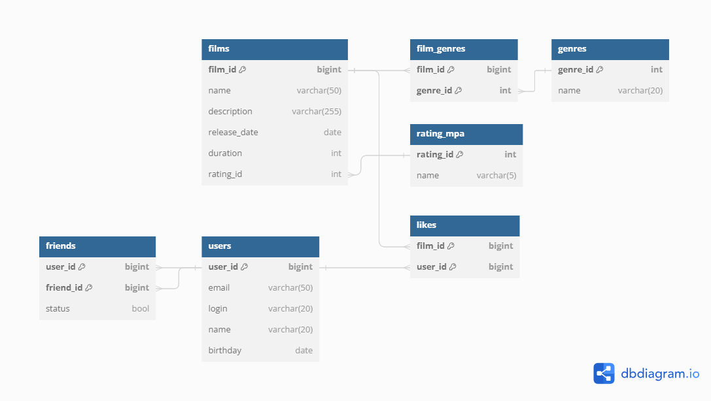

# java-filmorate
Template repository for Filmorate project.

## ER-diagram



````
Table films {
  film_id int [primary key]
  name varchar(50) 
  description varchar(255)
  release_date date 
  duration int 
  rating_id int 
}

Table users {
  user_id int [primary key]
  email varchar(50) 
  login varchar(20) 
  name varchar(20)
  birthday date
}

Table likes {
  film_id int [primary key]
  user_id int [primary key]
}

Table genres {
  genre_id int [primary key]
  name varchar(20)
}

Table rating_mpa {
  rating_id int [primary key]
  name varchar(5)
}

Table film_genres {
  film_id int [primary key]
  genre_id int [primary key]
}

Table friends {
  user_id int [primary key]
  friend_id int [primary key]
  status bool
}

Ref: users.user_id < likes.user_id
Ref: films.film_id < likes.film_id
Ref: films.rating_id > rating_mpa.rating_id
Ref: genres.genre_id < film_genres.genre_id
Ref: films.film_id < film_genres.film_id
Ref: users.user_id < friends.user_id
Ref: users.user_id < friends.friend_id

````